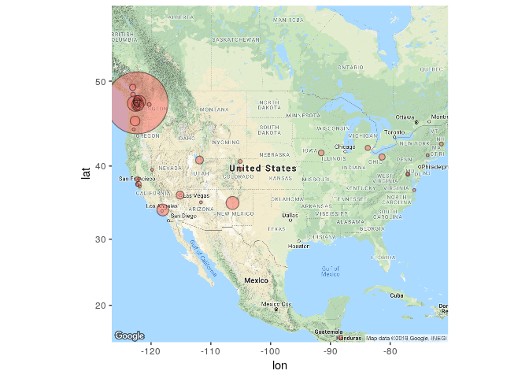

# Map of Server Logins
Brian High  
12/03/2015  

## Server logins

A "login" is merely the event of a computer account logging into a computer. 
It is an approximation of amount of usage, but will under-represent users 
who stay logged in for a long duration of time. These users may, in fact, use 
the resource more than a user who connects frequently, but for short periods.

We will explore data obtained from logfile analysis of a server used at the
University of Washington for remote access to computing resources. The data
show counts of logins for general locations, such as cities and the internet
service providers who provide address blocks for end-users. Any personally 
identifiable information (PII) has already been scrubbed from the data files. 

## Set up our environment

Set document rendering options.
 

```r
# Configure `knitr` options.
library(knitr)
opts_chunk$set(tidy=FALSE, cache=FALSE)
```

Install packages if needed.


```r
# Install packages (if necessary)
for (pkg in c("dplyr", "pander", "ggmap")) {
    if (! suppressWarnings(require(pkg, character.only=TRUE)) ) {
        install.packages(pkg, repos="http://cran.fhcrc.org", dependencies=TRUE)
        if (! suppressWarnings(require(pkg, character.only=TRUE)) ) {
            stop(paste0(c("Can't load package: ", pkg, "!"), collapse = ""))
        }
    }
}
```

## Read the data

Load the city login counts from a plain-text CSV file.


```r
cities <- read.csv("cities.csv")
```

## Take a look at the data

See which cities in which countries we are trying to map. List the top cities.


```r
# Top-ten cities by login count
cities[,1:4] %>% head(10) %>% pandoc.table(style='rmarkdown')
```


|      city      |  region  |  country  |  logins  |
|:--------------:|:--------:|:---------:|:--------:|
|    Seattle     |    WA    |    US     |   746    |
|  Port Orchard  |    WA    |    US     |    45    |
|  Cedar Crest   |    NM    |    US     |    30    |
|     Duvall     |    WA    |    US     |    28    |
|      Kent      |    WA    |    US     |    26    |
|    Arcadia     |    CA    |    US     |    25    |
|    Portland    |    OR    |    US     |    16    |
|    Redmond     |    WA    |    US     |    14    |
|   Las Vegas    |    NV    |    US     |    10    |
| Salt Lake City |    UT    |    US     |    10    |

Most logins are from Seattle, but what is the percentage of Seattle logins?


```r
# Percent of logins from Seattle
percent_seattle <- round(
    sum(cities[cities$city == "Seattle" & cities$region == "WA", "logins"]) / 
    sum(cities[, "logins"]) * 100, 1)
percent_seattle
```

```
## [1] 70.3
```

List the top countries.


```r
# Top-ten countries by login count
cities %>% group_by(country) %>% 
    summarize(logins=sum(logins)) %>% arrange(desc(logins)) -> countries
countries %>% head(10) %>% pandoc.table(style='rmarkdown')
```


|  country  |  logins  |
|:---------:|:--------:|
|    US     |   1051   |
|    CA     |    6     |
|    HN     |    3     |
|    ZA     |    1     |

Find percent of logins from the US.


```r
# Percent of logins from US
percent_us <- round(
    sum(cities[cities$country == "US", "logins"]) / 
    sum(cities[, "logins"]) * 100, 1)
percent_us
```

```
## [1] 99.1
```

So, 70.3 % of the logins are from Seattle and 99.1 %
are from the US. 

## Make the map

We can center the map on the center of the US (Kansas) and zoom so that we 
pick up some of the locations in the rest of North America and Central America.


```r
google_basemap <- get_map(location = "Kansas", zoom = 4)

ggmap(google_basemap) + geom_point(data = cities, 
                                   aes(x = longitude, y = latitude,
                                fill = "red", alpha = 0.8), 
                                size = (cities$logins)^.5, shape = 21) + 
    guides(fill=FALSE, alpha=FALSE, size=FALSE)
```

 

## Make a density map

Let's zoom in on logins from the Puget Sound area with a density map. The data 
file we will use has login counts and geolocations for the IP address blocks 
used by the hosts accessing the server. 

The geolocations correspond to the locations of the internet access providers, 
not the actual locations of the end-users of the server.


```r
addr <- read.csv("addr.csv")
pslatlon <- geocode("Puget Sound")
psarea <- subset(addr, 
                 pslatlon$lon-2 <= longitude & longitude <= pslatlon$lon+2 &
                 pslatlon$lat-.5 <= latitude & latitude <=  pslatlon$lat+.5
)

qmplot(longitude, latitude, data = psarea, maptype = "toner-lite", 
       geom = "density2d", color = I("red"))
```

 

## A density map with more color

Let's zoom in a little on the University of Washington's Seattle campus and 
make a density plot with a color gradient over a color background map.


```r
pslatlon <- geocode("University of Washington, Seattle, WA")

psarea <- subset(addr, 
                 pslatlon$lon-.14 <= longitude & longitude <= pslatlon$lon+.14 &
                 pslatlon$lat-.14 <= latitude & latitude <= pslatlon$lat+.14
)

ps_basemap <- get_map(location = "University of Washington, Seattle, WA", 
                      zoom = 11)

ggmap(ps_basemap, extent = "device") + 
    geom_density2d(data = psarea, 
        aes(x = longitude, y = latitude), size = 0.3) + 
    stat_density2d(data = psarea, 
        aes(x = longitude, y = latitude, fill = ..level.., alpha = ..level..), 
        size = 0.01, bins = 16, geom = "polygon") + 
    scale_fill_gradient(low = "green", high = "red") + 
    scale_alpha(range = c(0, 0.3), guide = FALSE)
```

 

## Sources

Map and geocoding sources: 

- _ggmap_. version 2.5.2. David Kahle and Hadley Wickham. [Web 3 Dec. 2015](https://github.com/dkahle/ggmap).
- _Google Maps_. Google, 3 Dec. 2015. [Web 3 Dec. 2015](http://maps.googleapis.com/maps/api/staticmap?center=37.697948,-97.314835&zoom=4&size=640x640&scale=2&maptype=terrain&language=en-EN&sensor=false).  
